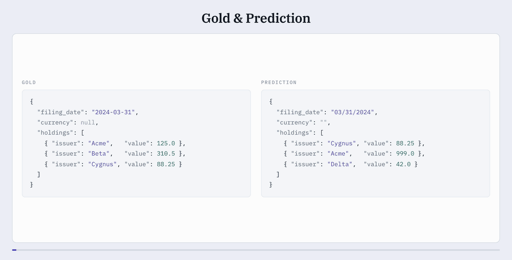

# Omni Extract Bench

This repository contains a way to run our benchmark using our dataset on [HuggingFace](https://huggingface.co/datasets/datalab-to/omni_extract_bench) or *your own dataset*. It also
provides lower-level primitives (`score` and `predict`) to run in your own pipelines however you like. The README is split up into the following table of contents.

1. **[Install](#install)** — the scorer on its own, or with the vendor adapters.
2. **[Run our benchmark with one line](#run-our-benchmark-with-one-line)** — rerun vendors on the benchmark dataset.
3. **[Score](#score)** — score predictions against ground-truth in your code or from the cli.
    - [What the metric does](#what-the-metric-does) — explains how the scoring works.
4. **[Predict](#predict)** — predict on one document and its schema in your code or from the cli.
5. **[Licence](#licence)** — Apache 2.0

And take a look at [`docs/API.md`](./docs/API.md) for more in-depth documentation of public functionality.

## Install


```bash
uv pip install omni-extract-bench                 # the scorer: score(), scipy and nothing else
uv pip install 'omni-extract-bench[harness]'      # + vendor adapters, to produce predictions
uv pip install 'omni-extract-bench[benchmark]'    # + packages to orchestrate and run benchmark
```

## Run our benchmark with one line

We provide orchestration to run our benchmark around our core primitives: `predict` and `score`.

See providers:

```bash
oeb providers
```
```
provider
───────────────────────
azure-cu
datalab
extend
llamaextract
mistral
reducto

openai/gpt-5.6-sol
anthropic/claude-opus-5
google/gemini-3.7-flash

the three model ids are examples: any OpenRouter org/model id works.
```

See what settings each provider takes and its default values. For example, datalab:

```bash
oeb providers datalab
```
```text
datalab
option          default
──────────────────────────────────────
mode            balanced
base_url        https://www.datalab.to
poll_interval   5.0

oeb benchmark --providers datalab --options '{"datalab": {"mode": ...}}'
```

Then run the benchmark (limit to 1 document here). It's **resumable** so you can stop and reinvoke to resume at any point.

**!!NOTE!!**: this will cost money and you will need your API keys set.

```bash
oeb benchmark --out runs/ --limit 1 \
    --providers datalab reducto extend llamaextract
```
```text
benchmark
out         runs
runs        4 over 4 adapters
corpus      huggingface datalab-to/omni_extract_bench
documents   1 document selected
timeout     1800s per document
score only  false
rescoring   false

╭──────────────┬─────────┬───────────────────────┬────────────────────────────────────────┬─────────┬───────╮
│ adapter      │ at once │ run                   │ settings                               │ predict │ grade │
├──────────────┼─────────┼───────────────────────┼────────────────────────────────────────┼─────────┼───────┤
│ datalab      │      10 │ datalab-f46415c9      │ base_url=https://www.datalab.to        │       1 │     1 │
│              │         │                       │ ────────────────────────────────────── │         │       │
│              │         │                       │ mode=balanced                          │         │       │
│              │         │                       │ ────────────────────────────────────── │         │       │
│              │         │                       │ poll_interval=5.0                      │         │       │
├──────────────┼─────────┼───────────────────────┼────────────────────────────────────────┼─────────┼───────┤
│ reducto      │       3 │ reducto-e54d3a1d      │ agentic_table_mode=max                 │       1 │     1 │
│              │         │                       │ ────────────────────────────────────── │         │       │
│              │         │                       │ deep_extract_model=v2                  │         │       │
│              │         │                       │ ────────────────────────────────────── │         │       │
│              │         │                       │ poll_interval=5                        │         │       │
│              │         │                       │ ────────────────────────────────────── │         │       │
│              │         │                       │ system_prompt=''                       │         │       │
├──────────────┼─────────┼───────────────────────┼────────────────────────────────────────┼─────────┼───────┤
│ extend       │       5 │ extend-7bbd41aa       │ api_version=2026-02-09                 │       1 │     1 │
│              │         │                       │ ────────────────────────────────────── │         │       │
│              │         │                       │ array_strategy=large_array_max_context │         │       │
│              │         │                       │ ────────────────────────────────────── │         │       │
│              │         │                       │ base_url=https://api.extend.ai         │         │       │
├──────────────┼─────────┼───────────────────────┼────────────────────────────────────────┼─────────┼───────┤
│ llamaextract │       3 │ llamaextract-76247dbb │ poll_interval=5                        │       1 │     1 │
│              │         │                       │ ────────────────────────────────────── │         │       │
│              │         │                       │ tier=agentic_plus                      │         │       │
╰──────────────┴─────────┴───────────────────────┴────────────────────────────────────────┴─────────┴───────╯
  proceed? [y/N]
```
If you proceed you'll see:

```text
 run                                        done   ok   err   in flight   cost   avg    dur
 ──────────────────────────────────────────────────────────────────────────────────────────
 datalab-f46415c9                            0/1    0     0         1/1                3.0s
 reducto-e54d3a1d                            0/1    0     0         1/1                3.0s
 extend-7bbd41aa                             0/1    0     0         1/1                3.0s
 llamaextract-76247dbb                       0/1    0     0         1/1                3.0s
0/4 documents  0 failed  4 in flight  3.0s elapsed
```

You can also specify settings per provider. For example:

```bash
oeb benchmark \
  --providers datalab reducto \
  --limit 1 \
  --options '{"datalab":  [{"mode": "balanced"}, {"mode": "accurate"}],
              "reducto": [{"agentic_table_mode": "max"},
                          {"agentic_table_mode": "default"}]}' \
  --out runs/
```

This will execute 4 different runs -- one for each pair (provider, settings).

See [`docs/API.md`](./docs/API.md) for more details on what `oeb benchmark` writes and **how you can run on your own benchmark dataset**.

## Score

Use in your own code.

```python
from omni_extract_bench import score

schema = {
  "type": "object",
  "properties": {
    "invoice_id": {
      "type": "string",
      "description": "The invoice number as printed on the document."
    },
    "invoice_date": {
      "type": "string",
      "description": "Date of issue, ISO 8601 (YYYY-MM-DD)."
    },
    "total_due": {
      "type": "number",
      "description": "Total amount payable, in the invoice currency."
    },
    "purchase_order": {
      "type": "string",
      "description": "Buyer's purchase order number, where the invoice cites one."
    },
    "line_items": {
      "type": "array",
      "description": "One entry per billed line.",
      "items": {
        "type": "object",
        "properties": {
          "sku": {"type": "string", "description": "Stock code for the item."},
          "description": {"type": "string", "description": "Item description as printed."},
          "qty": {"type": "integer", "description": "Units billed."},
          "unit_price": {"type": "number", "description": "Price per unit."}
        }
      }
    }
  }
}

prediction = {
  "invoice_id": "INV-4417",
  "invoice_date": "03/31/2024",
  "total_due": "1,240.00",
  "purchase_order": "PO-88231",
  "currency": "USD",
  "line_items": [
    {"sku": "BX-2201", "description": "Washer, 8mm", "qty": 100, "unit_price": 9.4},
    {"sku": "AX-9910", "qty": 24, "unit_price": 12.05},
    {"sku": "ZZ-0000", "description": "Freight surcharge", "qty": 1, "unit_price": 45.0}
  ]
}

ground_truth = {
  "invoice_id": "INV-4417",
  "invoice_date": "2024-03-31",
  "total_due": 1240.0,
  "line_items": [
    {"sku": "AX-9910", "description": "Hex bolt, M8", "qty": 24, "unit_price": 12.5},
    {"sku": "BX-2201", "description": "Washer, 8mm", "qty": 100, "unit_price": 9.4}
  ]
}

result = score(prediction, ground_truth, schema)
result["accuracy"]    # 0.5294 -- matched addresses / addresses either document used
result["precision"]   # 0.5625
result["recall"]      # 0.8182
```

or from the command line.


```bash
oeb score --pred pred.json --gt gold.json --schema schema.json
```

```json
{
  "accuracy": 0.5294117647058824,
  "precision": 0.5625,
  "recall": 0.8181818181818182,
  "f1": 0.6666666666666666,
  "total": 17,
  "matched": 9,
  "misread": 1,
  "unfound": 1,
  "fabricated": 1,
  "invented_item": 4,
  "invented_field": 1,
  "asserted": 16,
  "addresses_found": 0.5882352941176471,
  "addresses_read_right": 0.9,
  "gt_rows": 2,
  "pred_rows": 3,
  "matched_rows": 2,
  "matching_exact": true,
  "approximated": [],
  "skipped_open_maps": []
}
```

Return with verdicts to dive deeper into exact places where the model failed.

```python

result = score(prediction, ground_truth, schema, verdicts=True)
print(result["verdicts"][0]) # print the first verdict
# {
#       "address": [["k", "currency"]],
#       "gold_raw": null,
#       "pred_raw": "USD",
#       "gold_canon": null,
#       "pred_canon": "usd",
#       "verdict": "invented_field"
#     }
```

From the cli.

```bash
oeb score --pred pred.json --gt gold.json --schema schema.json --verdicts
```

On the example above, printing one line each:

```
{
  "accuracy": 0.5294117647058824,
  "precision": 0.5625,
  "recall": 0.8181818181818182,
  "f1": 0.6666666666666666,
  ...
  "verdicts": [
    {
      "address": [
        [
          "k",
          "currency"
        ]
      ],
      "gold_raw": null,
      "pred_raw": "USD",
      "gold_canon": null,
      "pred_canon": "usd",
      "verdict": "invented_field"
    },
    ...truncated for display
```


### What the metric does



- Normalize document;
- Flatten prediction and gold JSON dictionary to addresses mapped to their scalar values;
- Normalize scalar values of the flattened addresses; and
- For each array that appears, Hungarian match (recursively for nested arrays) based on array element content to align ambiguous predicted and gold addresses (there may unmatched predicted addresses — false positives, and unmatched gold addresses — false negatives).

Full specification: [`docs/METRIC_SPEC.md`](./docs/METRIC_SPEC.md).

## Predict

Predict using our provider harnesses.

```bash
uv pip install 'omni-extract-bench[harness]'
```

```python
from omni_extract_bench.harness import predict

record = predict("datalab", "invoice.pdf", schema)
record["result"]
record["raw"]
record["cost"]
```

Score directly from the predictions.

```python
from omni_extract_bench import score
score(record["result"], gold, schema)
```

You can also use the cli:

```bash
oeb predict --provider datalab --doc invoice.pdf --schema schema.json
```


## Licence

Apache 2.0 — see [`LICENSE`](./LICENSE). All code here is Datalab's own.
